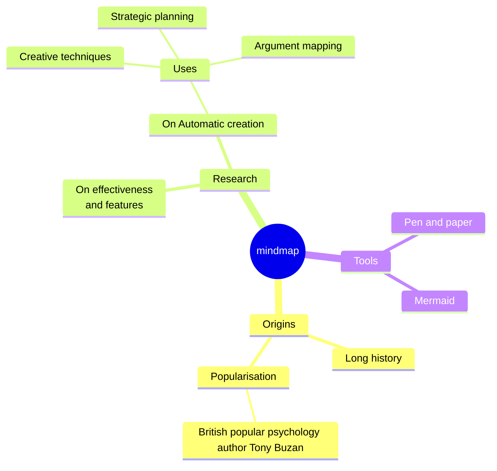
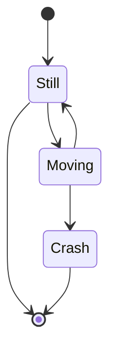

For a Jacketed Continuous Flow Stirred Tank
- Volume - Height : 
- Impeller Speed :
- Temperature \& Pressure of Steam \& Condensate : 
- Temperature inside the (required) CV : 
- Change in Pressure in side the CV : 
- Temperature \& Pressure of Fluid incoming and outgoing CV : 
- 

![[Screenshot_20250225_120708.png]]

Enthalpy of Vessel at time t = $V\rho C_p (T-T_{ref}) = V\rho C_pT|_t$
Enthalpy of Vessel at time $t+\Delta t$ = $V\rho C_p T|_{t+\Delta t}$
Enthalpy in by Flow = $F\Delta t \rho C_p T_{in}$
Enthalpy out by Flow = $F\Delta t \rho C_p T$
Enthalpy Transferref by Steam = $Q\Delta t = m_{steam}\Delta t \lambda = UA(T_{in} -T)$

$\frac{V\rho C_p T|_{t+\Delta t}-V\rho C_p T|_{t}}{\Delta t} = F\Delta t \rho C_p T_{in} -F\Delta t \rho C_p T + m\Delta t\lambda$

$\frac{dT(t)}{dt} = \frac{F}{V}(T_{in}(t)-T(t))+\frac{\lambda}{V\rho C_p}m(T)$
$0 = \frac{F}{V}(T_{in,s}(t)-T_s(t))+\frac{\lambda}{V\rho C_p}m_s(T)$  at Steady State Condition

$\therefore$  Subtracting to get Deviation variable form we get,
$\frac{d(T-T_s)}{dt} = \frac{F}{V}((T_{in}-T_{in,s})-(T-T_s))+\frac{\lambda}{V\rho C_p}(m-m_s)$
$\frac{d\bar T(t)}{dt} = \frac{F}{V}(\bar T_{in}(t)-\bar T(t))+\frac{\lambda}{V\rho C_p}\bar m(T)$

Taking The Laplace of the Above equation,
$s\bar T(s) - \bar T(0)= \frac{F}{V}(\bar T_{in}(s)-\bar T(s))+\frac{\lambda}{V\rho C_p}\bar m(s)$
$\left(s+\frac{F}{V}\right)\bar T(s) = \frac{F}{V}\bar T_i(s) + \frac{\lambda}{V\rho C_p}\bar m(s)$

Rearranging the Equation,
$\bar T(s) = \frac{1}{\frac{V}{F}s+1}\bar T_i(s)+\frac{\frac{\lambda}{F\rho C_p}}{\frac{V}{F}s+1}\bar m(s)$
$\bar T(s) = \frac{1}{\tau s+1}\bar T_i(s)+\frac{\frac{\lambda}{F\rho C_p}}{\tau s+1}\bar m(s)$

$G_1(s) = \frac{\bar T(s)}{\bar T_i(s)} = \frac{K_{p1}}{\tau s+1}$
$G_2(s) = \frac{\bar T(s)}{\bar m(s)} = \frac{K_{p2}}{\tau s+1}$

>$$\bar T(s) = G_1\bar T_i(s) +G_2 \bar m(s)$$

> [!Question] Question
> For the above system 
> $T_i = 30 \degree C,\ \ \ F_s = 10 \ m^3/hr,\ \ \ \rho = 1000\ kg/m^3$
> $T_{st} = 105 \degree C,\ \ \rho_{st} = 0.6\ kg/m^3,\ \ \lambda = 500 kcal/kg$
> $T_s = 60 \degree C$
> 1. $10\%$ change on steam flow rate and $3\degree C$ change in inlet temperature 
> 2. After new SS is achieved then, $T_i = 2\degree C$ and mass flow Rate Decrease by $5\%$

$F_{st} = 600 kg/hr = 1000 m^3/hr$

$G_1 = \frac{1}{0.2s+1}$
$G_2 = \frac{\frac{500\times 4.18\times 1000}{10000\times4.18\times 1000}}{\frac{2}{10}s+1} = \frac{0.05}{0.2s+1}$
$\bar T(s) = \frac{1}{0.2s+1}\bar T_i(s)+\frac{0.05}{0.2s+1}\bar m(s)$
$\bar T(s) = \frac{1}{0.2s+1}\frac{3}{s}+\frac{0.05}{0.2s+1}\frac{60}{s}$
$\bar T(s) = \frac{15}{s(0.2s+1)} = \frac{30}{s(s+5)} = \frac{6}{s}-\frac{6}{s+5}$
$\bar T (t) = 6(1-e^{-5t})$
![[Screenshot_20250304_112207.png]]

New steady State 
$\bar T_i(S) = 2/s$ $\bar m(s) = -33/s$
$\bar T(s) = \frac{1.75}{s(s+5)}$
$\bar T(t) = 0.35(1-e^{-5t})$
![[Screenshot_20250304_113341.png]]

$m_s\times 4.18 = 10\times 100\times 4.18 \times(66.35-35)$
$m_s = 500 kg/hr$

## Closed Loop Transfer Function with Feedback Loop

$$
\begin{align*}
C(s) &= G_p(s)+G_Ld(s)\\
&=G_pG_Vp(s)+G_Ld(s)\\
&=G_pF_VG_C(R-B)+G_Ld(s)\\
&=G_pF_VG_C(R-HC(s))+G_Ld(s)\\
C(s)&=\frac{G_pG_VG_CR+G_Ld(s)}{1+G_pG_VG_CH}
\end{align*}
$$
>$$
\boxed{\bar C(s)=\frac{G_pG_VG_C}{1+G_pG_VG_CH}\bar R(s) +\frac{G_L}{1+G_pG_VG_CH}\bar d(s)}
$$

For $K_C = 1 , 5, 10$

$$
\begin{align*}
\bar C(s)&=\frac{\frac{3}{s}\times\frac{1}{0.2s+1}}{1+\times\frac{0.05}{0.2s+1}\times100\times K_c\times 1}\\
&\bigg|_{K_c=1}=&\frac{15}{s(s+30)}\\
\end{align*}
$$

![[Screenshot_20250311_105613.png]]

$$
\begin{align*}
\frac{\bar C(s)}{\bar R(s)}&=\frac{G_pG_VG_C}{1+G_pG_VG_CH} \\
&=\frac{K_cK_v \frac{K_p}{\tau s+1}}{1+k_cK_vK_p\frac{1}{\tau s+1}}\\
&= \frac{\frac{K_cK_vK_p}{1+K_pK_vK_c}}{\frac{\tau}{1+K_cK_vK_p}+1}\\
\therefore \frac{\bar C(s)}{\bar R(s)} &= \frac{K_p'}{\tau' s+1}
\end{align*}
$$

For a unit step change in $\bar R(s)$
$\bar C(s) = \frac{1}{s}\frac{K_p'}{\tau' s +1}$
$\bar C(t) = K_p'(1-e^{-t/\tau'})$
$\bar C(\infty) = 1$
Difference between the change in the set value $R$ and change in the Output $C$ = $1- K_p'$ = OFFSET

#### Proportional Integral Controller

For a PI Controller,
$K_c = 1+\frac{1}{s}$
$p(t) = K_c\epsilon(t) +\frac{K_c}{\tau_I}\int^t_0\epsilon(t)dt$
$p(s) = K_c\epsilon (s) +\frac{K_c}{\tau_I}\frac{1}{s}\epsilon(s)$
$\frac{p(s)}{\epsilon (s)} = K_c\left(1+\frac{1}{\tau_I s}\right)$

$\frac{\bar C(s)}{\bar R(s)} = \frac{(1+\frac{1}{s})\times 100 \times \frac{0.05}{0.2s+1}}{1+(1+\frac{1}{s})\times 100 \frac{0.05}{0.2s+1}} = \frac{(s+1)\times25}{s(s+5) +(1+s)\times 25} = \frac{25(s+1)}{s^2+30s+25}$
$\frac{\bar C(s)}{\bar R(s)} = \frac{(1+\frac{1}{s})\times 100 \times \frac{0.05}{0.2s+1}}{1+(1+\frac{1}{s})\times 100 \frac{0.05}{0.2s+1}} = \frac{(s+1)\times25}{s(s+5) +(1+s)\times 25} = \frac{25(s+1)}{s^2+30s+25} = 25\frac{s+1}{(s+15-10\sqrt{2})(s+15+10\sqrt{2})}$
$\bar C(s) = 25\left[\frac{1}{\frac{1}{5}^2 s^2+2\frac{1}{5}3s+1}+ \frac{1}{s(s+15-10\sqrt{2})(s+15+10\sqrt{2})}\right]$

$\bar C(s) = \left[\frac{25}{\frac{1}{5}^2 s^2+2\frac{1}{5}3s+1}- \frac{1}{s}+\frac{1}{(s+15-10\sqrt{2})}+\frac{1}{(s+15+10\sqrt{2})}\right]$
$\bar C(t) = 25[1+e^{15t}\left[...\right]] 1 +e^{(-15+10\sqrt{2})t}+e^{(-15-10\sqrt{2})t}$

$$
\frac{\bar C(s)}{\bar d(s)}=\frac{G_L}{1+G_pG_VG_CH}
$$
$\bar C(s) = \frac{2}{s}\frac{\frac{1}{0.2s+1}}{1+(1+\frac{1}{s})\times100\times\frac{0.05}{0.2s+1}}$
$\bar C(s) = 2\frac{5}{s(s+5)+(s+1)25} = \frac{10}{s^2+30s+25}$ 
$\bar C(s) = \frac{10}{\sqrt{200}}\sinh(\sqrt{200}t)e^{-15t}$

![[Screenshot_20250311_120406.png]]

$$
\bar C(s)=\frac{G_pG_VG_C}{1+G_pG_VG_CH}\bar R(s) +\frac{G_L}{1+G_pG_VG_CH}\bar d(s) = \frac{\bar Q(s)}{\bar P(s)}
$$
$\frac{\bar Q(s)}{\bar P(s)} = \frac{Q(s)}{(s-a_1)(s-a_2)\ldots(s-a_n)} = \frac{A_1}{s-a_1}+\frac{A_2}{s-a_2}+\ldots+\frac{A_n}{s-a_n}$
$\frac{1}{s-a}$ for +ve a $\to e^{at} \implies$ unstable
$\frac{1}{s-a}$ for -ve a $\to e^{-at} \implies$ stable
$\frac{1}{s-a}$ for +ve a in $a+ib$ $\to e^{at}e^{ibt} \implies$ unstable
$\frac{1}{s-a}$ for -ve a in $a+ib$ $\to e^{-at}e^{ibt} \implies$ stable

- Proportional Time  = $\frac{100}{K_c}$
- Rate = $\frac{1}{\tau_I}$
- first Order System Capacity = $G_{p} = \frac{K_p}{\tau s+1}$
- Second Order System = $G_p = \frac{K_p}{\tau^2 s^2+2\xi\tau s+1} = f(K_p,\tau,\xi)$
![[Screenshot_20250401_112327.png]]

$y(t) = x(t-t_d)$
$y(s) = e^{-\tau_d s}x(s)$
$\frac{y(s)}{x(s)} = e^{-\tau_d s}$
### Pade's Approximation
$$
\frac{C(s)}{R(s)} = \frac{G_cG_vG_pe^{-\tau_ds}}{1+G_cG_vG_pe^{-\tau_ds}H}
$$
$e^{-tau_ds} \approx \frac{1-\frac{\tau_s}{2}s}{1+\frac{\tau_s}{2}s}$

#### Zeigler Nichols Method
1. $\tau_i \to \infty, \tau_d =0$ so that $G_C=K$ and Increase the $K_C$ so as to get sustained oscillation; this $K_U$ is the **Ultimate Gain of Controller** and the corresponding time period of oscillation is the ultimate period .

| Z_N Setting | P      | PI      | PID    |
| ----------- | ------ | ------- | ------ |
| K_c         | 0.5K_U | 0.45K_U | 0.6K_U |
| \tau_I      | -      | P_U/1.2 | P_U/2  |
| \tau_D      | -      | -       | P_U/8  |

2. With no overshoot

| Z_N Setting | no overshoot | Slight Overshoot |
| ----------- | ------------ | ---------------- |
| K_c         | 0.2K_U       | 0.3K_U           |
| \tau_I      | P_U/2        | P_U/2            |
| \tau_D      | P_U/2        | P_U/3            |

##### Using process reaction curve methods

| Z_N Tuning Parameters - Open Loop | P                | PI                  | PID                 |
| --------------------------------- | ---------------- | ------------------- | ------------------- |
| K_c                               | (\tau/\tau_d)K_p | 0.9(\tau/\tau_d)K_p | 1.2(\tau/\tau_d)K_p |
| \tau_I                            | -                | \tau/0.3            | \tau_d/0.5          |
| \tau_D                            | -                | -                   | 0.5\tau_d           |

