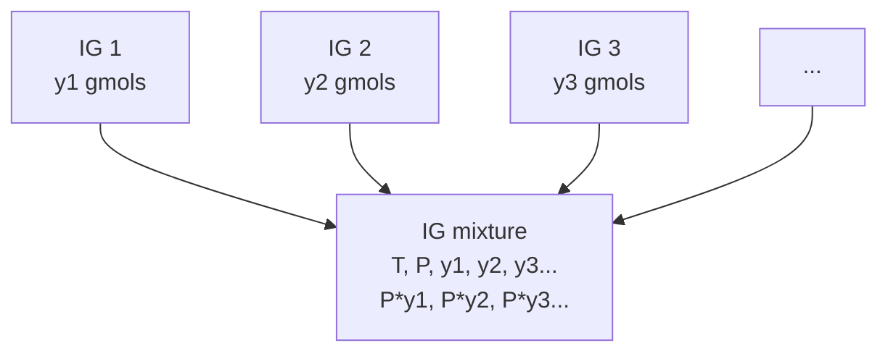

[[Conservation of Energy]]
[[Entropy]]
[[Will Name it Later...]]
[[Mixtures]]

> [!warning] Key **Assumptions** for ***IGM***
> - Size and Shape of the molecules of all the components are the same. 
> - The change in volume upon mixing $\Delta V_{\text{mix}} = 0$. 
> - The change in enthalpy upon mixing $\Delta H_{\text{mix}} = 0$. 
> - The change in internal energy upon mixing $\Delta U_{\text{mix}} = 0$.

$$
\begin{align*}
	\Delta_{mix}V &= V - \sum y_iV_i = 0 \\
	&= \sum yi \bar{V_i} - \sum y_iV_i = 0 \\
	\implies \bar{V_i} &= V_i
\end{align*}
$$
Hence the Partial molar volume for each component is same as the molar volume for each individual component respectively.
Similarly,
$$
\begin{align*}
	\Delta_{mix}U &= 0 \implies \bar{U_i} = U_i\\
	\Delta_{mix}H &= 0 \implies \bar{H_i} = H_i
\end{align*}
$$

However the the case is different when it comes to ***Entropy***.
- **Nature of Measurement**: The entropy change $\Delta S_{\text{mix}}$ is not zero because gases mix, increasing the overall disorder of the system, while internal energy ($U$), enthalpy ($H$), and volume ($V$) represent energy and spatial characteristics.
- **Response to Mixing**:Initially, each gas is at 1 atm; after mixing, the total pressure remains the same, introducing partial pressures for each gas.
- **Spontaneity of Processes**: This mixing is a spontaneous process that enhances chaos, leading to a greater number of accessible microstates.
- **Additivity**: Entropy is additive for independent subsystems, leading to a total entropy that differs conceptually from the treatment of energy or volume in mixtures.

But for Entropy, the temperature of the IGM remains constant but the presssure of individual components in the mixture changes as funtion of mole fraction hence,
$$
\Delta _{mix}S = 
\begin{array}{c}
\text{Entropy} \\
\text{Change in} \\
\text{Component 1}
\end{array}
+
\begin{array}{c}
\text{Entropy} \\
\text{Change in} \\
\text{Component 2}
\end{array}
+
\begin{array}{c}
\text{Entropy} \\
\text{Change in} \\
\text{Component 3}
\end{array}
+\ldots
$$
$$
\because \Delta S = - R\ln \left(\frac{P_i}{P^{IGM}}\right)
$$
$$
\begin{align*}
\therefore \Delta_{mix}S &= -R \left[\sum y_i \ln y_i\right]\\
\sum y_i(\bar S_i - S_i) &= -R \left[\sum y_i \ln y_i\right]\\
\bar S_i - S_i &= -R \ln y_i \\
\end{align*}
$$

Similar for Gibbs Energy which is also subject to change in pressure,
$$
\begin{align*}
\therefore \Delta_{mix}G &= -RT \left[\sum y_i \ln y_i\right]\\
\sum y_i(\bar G_i - G_i) &= -R \left[\sum y_i \ln y_i\right]\\
\bar G_i - G_i &= RT \ln y_i \\
\end{align*}
$$
# Non-ideal Mixture

> [!Assumption] Ideal Mixture
> Size and Shape of all constituent Molecules of all components are same.
> The change in volume upon mixing $\Delta V_{\text{mix}} = 0$. 
> The change in enthalpy upon mixing $\Delta H_{\text{mix}} = 0$. 
> The change in internal energy upon mixing $\Delta U_{\text{mix}} = 0$.
> - Note: IM and IGM are not same.

## Excess Property
$$
M^{ex} = \Delta_{mix}M - \Delta_{mix}M^{IM}
$$
$\Delta_{mix}M^{IM}$ is the change in property if the mixture would had behaved like ideal mixture.

But for Enthalpy, Internal Energy and Molar Volume,
$$
\begin{align*}
	H^{ex}\  &=\  \Delta_{mix}H\\
	U^{ex}\  &=\  \Delta_{mix}U\\
	V^{ex}\  &=\  \Delta_{mix}V\\
\end{align*}
$$

For Gibbs Free Energy,
$$
\begin{align*}
	G^{ex} &= \Delta_{mix}G - \Delta_{mix}G^{IM}\\
	G^{ex} &= \Delta_{mix}G - RT\sum x_i\ln x_i
\end{align*}
$$
Similarly for Entropy
$$
\begin{align*}
	S^{ex} &= \Delta_{mix}S - \Delta_{mix}S^{IM}\\
	S^{ex} &= \Delta_{mix}S + R\sum \ln x_i
\end{align*}
$$
$$
\begin{align*}
	M^{ex} &= \Delta_{mix}M - \Delta_{mix}M^{IM}\\
	&= (M - \sum x_i M_i) -(M^{IM} - \sum x_iM_i)\\
	M^{ex} &= M - M^{IM}\\
	M^{ex} &= \sum x_i \bar{M_i} - \sum x_i\bar{M_i}^{IM}\\
	&= \sum x_i \left[\bar M_i -\bar M_i^{IM}\right]\\
	& \\
	\text{We get the}&\text{ Partial Molar Property by differntiating }\bar M_i^{ex} \text{ wrt } n_i, \\
	& \\
	\bar M_i^{ex} &= \frac{\partial }{\partial n_i}(n^tM^{ex}) \bigg|_{T,P,n_{j\neq i}}\\
	\bar M_i^{ex} &= \frac{\partial }{\partial n_i}\left[n^t\sum x_i \left[\bar M_i -\bar M_i^{IM}\right]\right]_{T,P,n_{j\neq i}}\\
	\bar M_1^{ex} &= \frac{\partial }{\partial n_1}n^t\left[ x_1 [\bar M_1 -\bar M_1^{IM}] + x_2 [\bar M_2 -\bar M_2^{IM} + \ldots\ ]  \right]_{T,P,n_{j\neq 1}}\\
	&= \bar M_1 -\bar M_1^{IM} + \sum \frac{\partial n_{j\neq 1}}{\partial n_1}\left(\bar M_{j \neq 1} -\bar M_{j\neq 1}^{IM}\right) + \sum n_i \frac{\partial}{\partial n_i}\left(\bar M_i - \bar M_i^{IM}\right)\\
	\bar M^{ex} &= \left(\bar M_1 - \bar M_1^{IM}\right) + n_1\frac{\partial}{\partial n_1} \left(\bar M_1 - \bar M_1^{IM}\right) + n_2\frac{\partial}{\partial n_1} \left(\bar M_2 - \bar M_2^{IM}\right) + \ldots\\
	\because\ \ \ \ \ n_i &= x_i n^t \\
	\therefore\ \bar M^{ex} &= \left(\bar M_1 - \bar M_1^{IM}\right) + x_1\frac{\partial}{\partial x_1} \left(\bar M_1 - \bar M_1^{IM}\right) + x_2\frac{\partial}{\partial x_1} \left(\bar M_2 - \bar M_2^{IM}\right) + \ldots\\
	&= \left(\bar M_1 - \bar M_1^{IM}\right) + \sum x_i \frac{d\bar M_i}{dx_i} -\sum x_i \frac{d\bar M_i^{IM}}{dx_i}\\
	& \\
	\text{Hence,}&\text{ we get the final result,}\\
	& \\
	\bar M ^{ex} &= \bar M_i -\bar M_i^{IM}
\end{align*}
$$
Analyzing Excess Enthalpy
$$
\bar H_i^{ex} = \bar H_i = \Delta_{mix}H
$$

For Gibbs Free Energy,

$$
\begin{align*}
	G^R = G - G^{IG} &= \int^P_0 \left( V - V^{IG} \right) dP = \int^P_0 \left(V - \frac{RT}{P}\right) dP \\
	&= RT\ln \frac{f}{P}
\end{align*}
$$

$$
\begin{align*}
	\bar G_i - \bar G^{IGM} &= \int^P_0 \left(\bar V_i -\bar V^{IGM}_i \right) dP = \int^P_0 \left(\bar V_i - V_i \right) dP \\
	&= RT\ln \left(\frac{\bar f_i}{P y_i}\right)
\end{align*}
$$

> [!NOTE] Remember
> 
> $$ 
> \begin{align*}
> \bar{f}_i \quad \text{or} \quad f^{\text{mix}}_i &= \text{Fugacity of Component `i' in the mixture} \\
> &\neq \text{Partial molar fugacity}
> \end{align*}
> $$

$$
\begin{align*}
\bar G^{ex}_i &= \bar G_i - \bar G^{IM}_i \\
&= \left( \bar G_i - \bar G^{IGM}_i \right) - \left(\bar G^{IM} - \bar G^{IGM}_i\right) \\
&= RT\ln\left(\frac{\bar f_i}{Py_i}\right) - \left(G_i + RT\ln y_i - (G^{IG}_i + RT \ln y_i)\right) \\
&= RT\ln\left(\frac{\bar f_i}{P y_i}\right) - \left(G_i - G^{IG}_i\right)\\
&= RT\ln\left(\frac{\bar f_i}{P y_i}\right) - G^R \\
&= RT\ln\left(\frac{\bar f_i}{P y_i}\right) - RT\ln\left(\frac{ f_i}{P}\right)\\
&\\
\therefore \bar G^{ex V} &= RT \ln \left(\frac{\bar f_i}{f_i y_i}\right)\\
\bar G^{ex L} &= RT \ln \left(\frac{\bar f_i}{f_i x_i}\right)
\end{align*}
$$

At Equilibrium,

$$
\begin{align*}
\bar G^V_i &= \bar G^L_i\\
\bar G^{ex V} + \bar G^{IM\ V}_i &= \bar G^{ex L} + \bar G^{IM\ L}_i \\
RT \ln \left(\frac{\bar f_i^V}{f_i^V y_i}\right) + G_i + RT \ln y_i &= RT \ln \left(\frac{\bar f_i^L}{f_i^L x_i}\right) + G_i + RT \ln x_i \\
&\\
\therefore \bar f_i^V & = \bar f_i^L 
\end{align*}
$$
This Implies, **Gibbs Energy in a Mixture is same as fugacity**.
$$
\bar G^{ex V}_i = RT \ln \left(\frac{\bar f^V_i}{y_if_i^V}\right)
$$
vapor in an ideal mixture,
$\bar G_i^{exV} = 0$ $\implies$ $\bar f_i = y_if_i$

but for a liquid,
$$
\bar G^{ex L}_i = RT \ln \left(\frac{\bar f^L_i}{x_if_i^L}\right)
$$
$\because$ no ideal mixture is in liquid State (ofc (；一_一) $\because size_{molecules} \not\ll \lambda$)

$\bar G^{ex L}_i \neq 0$ $\implies$ $\bar f^L_i \neq x_if_i^L$

Therefore we use,
$$
\bar f_i^L = a_if^L_i
$$
where $a_i$ is called Activity

The **activity** of a chemical entity is a dimensionless quantity derived by multiplying a correction factor (called an **activity coefficient**) by some measure of its molar abundance, such as molar concentration (molarity), molality, partial pressure, or mole fraction.

$$
a_i = \gamma_i x_i \tag{1}
$$

Activities are thus used as “effective concentrations” and are necessary to the extent that chemical behavior is not ideal – i.e., strictly proportional to molar abundance – and so $\gamma_i \neq 1$. Formally, $a_i$ is defined by Equation below, where it is described as a function of the difference between the chemical potential of $i$ ($\mu_i$) and its chemical potential in some standard state, temperature ($T$), and the gas constant ($R$).

$$
a_i = \exp \left( \frac{\mu_i - \mu_i^\circ}{RT} \right) \tag{2}
$$

$$
\begin{align*}
\bar{f}_i^L &= \left(\gamma_i x_i \right) f_i^L\\
y_if_i^V &= \gamma_i x_i f_i^L \\
y_i \left(P \Phi_i^{^{=1}}\right) &= \gamma_i x_i f_i^{sat}\exp\left[\frac{V^L (P -P^{sat})}{RT}\right] \\
Py_i &= \gamma_i^{^{=1}} x_i (P_i^{sat}\Phi_i^{sat^{=1}})\\
\therefore Py_i &= x_iP_i^{sat}
\end{align*}
$$

## Gibbs Phase Rule for Multicomponent, Multiphase Systems

The **Gibbs phase rule** determines the number of **degrees of freedom** ***F*** in a system with multiple components and phases, enabling us to understand how many variables need to be specified to completely define the system's thermodynamic state.

For a **single-phase, C component** system, the thermodynamic state can be fixed by specifying two **intensive variables** (such as temperature  T  and pressure  P ) along with  C - 1  **mole fractions** for the components. Alternatively, any set of **C + 1  independent state variables** can define this state, meaning we have **C + 1  degrees of freedom** in a single-phase system with  C  components. Once these variables are set, all other thermodynamic properties are fixed.

For example, in a **single-phase,  C component** system, possible equations of state include:
$$
V = V(T, P, x_1, \dots, x_{C-1})
$$
$$
S = S(T, P, x_1, \dots, x_{C-1})
$$
$$
G = G(T, P, x_1, \dots, x_{C-1})
$$

In a **multiphase** system, phase equilibrium adds restrictions. For equilibrium:
- **Temperature** must be the same across phases:
  $$
  T^I = T^{II} = \dots = T^P
  $$
  This adds  P - 1  restrictions.
- **Pressure** must be equal across phases:
$$
  P^I = P^{II} = \dots = P^P
  $$
  This adds another  P - 1  restrictions.
- **Chemical Potential** (or partial molar Gibbs energy) of each component must be the same in each phase, adding C(P - 1) constraints:
  $$
  G_i^I = G_i^{II} = \dots = G_i^P, \quad i = 1, 2, \dots, C
  $$

Using this, we derive the Gibbs phase rule:
$$
\begin{align*}
\mathcal{F} &= 
\left(
\begin{array}{c}
\text{Number of Unknown} \\
\text{thermodynamic } \\
\text{parameters}
\end{array}
\right)
-
\left(
\begin{array}{c}
\text{Number of independent} \\
\text{relations among the } \\
\text{unknown parameters}
\end{array}
\right) \\
\\
&= \mathcal{P}(C + 1) - [2(\mathcal{P} - 1) + C(\mathcal{P} - 1) + \mathcal{M}]\\
\\
\mathcal{F} &= C - \mathcal{M} - \mathcal{P} + 2
\end{align*}
$$

For a system without chemical reactions $( M = 0)$, it simplifies to: $\mathcal{F = C - P}  + 2$ This rule determines how many independent variables are needed to define the system's thermodynamic state.

## Binary VLE

Let’s walk through the process with the help of a practical example involving a **binary mixture of Benzene** and **Toluene**. In this system, the key variables to consider are:
- **Temperature (T)** 
- **Pressure (P)** 
- **Vapor-phase mole fraction of Benzene $y_B$** 
- **Liquid-phase mole fraction of Benzene $x_B$** 
- 
To determine the equilibrium state of the mixture, we can specify any **two** of these variables. Once two variables are defined, the remaining two will automatically fixed and can be determined using either the **Lewis-Randall Rule**, the **excess function equation**, or other **equilibrium relations**.

Volatility is given by: $\frac{y_i}{x_i}$

hence, Volatility of **Benzene** = $\frac{y_B}{x_B} > 1 \quad (\text{for this example})$
and Volatility of **Toluene** = $\frac{y_T}{x_T} <1$

The Relative Volatility is defined as ratio of volatility of a more volatile component to that of less in a binary component system:

$$
\text{Rel. Volatility} = \alpha =\frac{\text{Volatility of Benzene}}{\text{Volatility of Toluene}} = \frac{\frac{y_B}{x_B}}{\frac{y_T}{x_T}}
$$
$\because$ Benzene is the more Volatile

$$
\begin{align*}
\alpha &= \frac{\frac{y_1}{x_1}}{\frac{1-y_1}{1-x_1}}\\
\\
\therefore y_1 &= \frac{\frac{\alpha}{1-x_1}}{\frac{\alpha}{1-x_1}+\frac{1}{x_1}}\\
\\
y_1 &= \frac{\alpha x_1}{1+(\alpha -1)x_1}
\end{align*}
$$
In general dropping the subscripts for simplification,

$$
y = \frac{\alpha x}{1+(\alpha -1)x}
$$

The Antoine equation used is :$\ln(P^{sat} (\text{mmHg})) = A - \frac{B}{T-C(K)}$

| Component   | A       | B        | C     |
| ----------- | ------- | -------- | ----- |
| **Benzene** | 4.72583 | 1660.652 | 1.461 |
| **Toluene** | 4.07828 | 1343.956 | 53.77 |

Keeping the Pressure Constant at 1bar,

| T (°C) | x₁  | y₁  | α        |
|--------|-----|-----|----------|
| 383.3  | 0   | 0   | -        |
| 375    | 0.2 | 0.38| 2.45161  |
| 367.8  | 0.4 | 0.62| 2.40473  |
| 362    | 0.6 | 0.79| 2.50794  |
| 357    | 0.8 | 0.92| 2.875    |
| 353    | 1   | 1   | -        |

![[Pasted image 20241107212002.png]]

Keeping the temperature constant
(Please do share if anyone has calculated for this part (╯︵╰,) )

## Henry's Law
## Roult's Law

## Gibbs Phase Rule
## Binary VLE in IM

