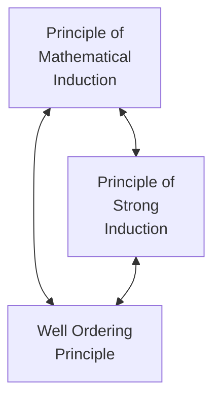

There is a classroom in ICT in which every bench is Broken.
$C$ = {Classroom in ICT} $\exists$ $x \in C$(every Bench in $x$ is Broken) 
$\forall\ x \in C$ ($\exists\ y \in B_x$(y is not Broken)) 
#### Family of Sets INDEXED by C
$x\ \ \in \ \ C$
${B_x : x\ \in X}$

| $\phi \neq I$        | $U=\mathbb{R}^2$                                                             |
| -------------------- | ---------------------------------------------------------------------------- |
| $\{1\}$              | $A_1 = {(3,1)}$                                                              |
| $\{1,2\}$            |                                                                              |
| $\{1,\ldots , 100\}$ | $i \in I_i$ , $A_i = \mathbb{R^2},\phi, \{i,i\}, \{(i,y): y\in \mathbb{R}\}$ |
| $\mathbb{N}$         | $m\in\mathbb{N}_i$ $A_i = \{(p,q): p,q\in \mathbb{N}\}$                      |
|                      |                                                                              |
$A_n = \{x \in \mathbb{R}:-n \leq x \leq n\}$
$$
\bigcup_{n\in \mathbb{N}} A_n = \mathbb{R}
$$
#### Well Ordering Principle
If $\phi \neq A \subseteq \mathbb{N}$ , then
$A$ has at least element i.e. $\exists\ a \in A \text{ s.t.}\ \forall\ x \in A , a\leq x$ 

### PRINCIPLE OF MATHEMATICAL INDUCTION
$\mathcal{S} \subseteq \mathbb{N}$ is s.t.
i. $1 \in \mathcal{S}$
ii. $n \in \mathcal{S} \ \implies n+1 \in \mathcal{S}$
Then $\mathbb{N} = \mathcal{S}$

### PRINCIPLE OF STRONG INDUCTION
$\mathcal{S}' \subseteq \mathbb{N}$ is s.t.
i. $1 \in \mathcal{S}'$
ii. $1,\cdots,n \in \mathcal{S}' \ \implies n+1 \in \mathcal{S}'$
Then $\mathbb{N} = \mathcal{S}'$
### Well Ordering Principle $\to$ Principle of Mathematical Induction
$\mathcal{S }\subseteq \mathbb{N}$ has (i) and (ii)
Claim: $\mathcal{S }\subseteq \mathbb{N}$
Assume: $\mathcal{S }\neq \mathbb{N} \implies \mathcal{S }\nsubseteq \mathbb{N}$ 
$\exists k \in \mathbb{N} (k \notin \mathcal{S})$ 
$A := \mathbb{N}\smallsetminus S = S^c$ , $\phi \neq A$
let $m:=$ least element of $A$
$S\cap A = \phi$
if, $m\in \mathbb{}N$ and $m>1\implies m-1>0 \implies m-1\geq 1$ 
$m-1 \in A$ & $m$ "least element" $\implies m\leq m-1$ \[**Contradiction**] 
$m-1 \in \mathcal{S}; (ii) \implies m \in \mathcal{S} \implies m \notin A$
$\implies$ our initial Assumption is False.
Hence, $\mathbb{N}\equiv \mathcal{S}$  

### Principle of Mathematical Induction $\to$ Well Ordering Principle 
If $A \subseteq \mathbb{N} \neq \phi$, then 
Prove that: $A$ has a least element i.e. $\exists a \in A (\forall x \in A(a\leq x))$ 
Assume : $A$ doesn't have a least element.
$1 \notin A \implies 1 \in \mathcal{S}:=N\smallsetminus A=A^c$ 
Form (i)&(ii) $\implies \mathcal{S}=\mathbb{N}$
$A = \mathbb{N}\smallsetminus \mathbb{N} = \phi$
Assume : $A$ doesn't have a least element.
To prove: $\mathcal{S}=\mathbb{N}$
%%Principle of Strong Induction %%
Assume: $1,\cdots, n \in \mathcal{S} = A^c; n+1 \in A^c$
if $n+1 \in A \implies 'n+1'$ is the least element.
hence, $n+1 \in A^c \implies A^c= \mathbb{N}$

> [!Tip] Number Theory let's Go!!!!
> $a,\ b \in \mathbb{Z}$ 
> $a$ divides $b$ or
> $a$ is a factor of $b$
> if $\exists\ k \in \mathbb{Z}\ |\ b=ak$

$a,b \in \mathbb{Z}$, assume $a>0$
$\exists q,r \in \mathbb{Z}$ s.t. $b=aq+r$ with $0\leq r<a$ 
Let's just say,
$aq_2 + r_2 = b = aq_1 + r1$ for $0 \leq r_1,r_2 <a$
Assume : $r_1 \leq r_2$ ; WLG $r_1>r_2$
$a (q_2-q_1) = r_1 -r_2 \implies a|r_1-r_2$ 
$\because 0<r_1-r_2 \leq r_1 <a \implies r_1-r_2<a \implies a \nmid r_1-r_2$ which contradicts the assumption

Lets\'s just consider the Whole number line,
$\mathcal{S}:= \{b-ax| b-ax\geq 0, x\in \mathbb{Z}\}$
by Well ordering Principle least element of $\mathcal{S}=:r$
$e\in \mathcal{S} \implies \exists\ q \in \mathbb{Z}$ s.t. $b-qa =r \geq0$
%% Prove S is non empty and r is least element %%

# Division Algorithm
$a,b \in \mathbb{Z}, b>0$
$\exists !\ q,r \in \mathbb{Z}$ s.t.                          $(\exists!) \to$ There exists unique
$a = bq+r, 0\leq r<|b|$
$\mathcal{S} := \{a-bk\ |\ k \in \mathbb{Z}\ and\ a-bk\geq0 \}$ 
$\mathcal{S}\neq \phi \subseteq \mathbb{N}\cup \{0\} \in$ WOP
WOP $\implies \exists$ a least element 
$r \in \mathcal{S} \quad \ r = a-qb \implies a = bq+r$
Suppose : $b \leq r$
$r =b +m, \ \ \ m \geq 0$
$m= a-b(q+1)$
$m \in \mathcal{S}, b>0 \implies m<r$

### Uniqueness
$bq' +r' =a =bq+r$
$b(q'-q) = r-r' \implies b\min r-r'$
assume: $r>r'$
but $0<r-r'<r<b$
$q-q'$ and $r-r'$ 

# GCD
$a,b \in \mathbb{Z}\ \quad gcd(a,b) = d =(a,b)$
1. $d|a$ and $d|b$
2. $c|a$ and $c|b \implies c\leq d$
3. $a|b \implies$ 
gcd(184,32) = 8
### Euclidean Algorithm
$$
\begin{align*}
b &= aq_1+r_1\\
a &= r_1q_2 +r_2\\
&\ \  \vdots\\
r_{n-2} &= r_{n-1}+q_n + r_n\\
r_{n-1}&= r_nq_{n+1}
\end{align*}
$$

$m \in \mathbb{Z}$
$D_m = \{k \in \mathbb{Z}\big| k\mid m\}$ = aet of all divisors of m
$|D_m|<\infty$
$\gcd (a,b) = \max \{D_a \cap D_b\}$ 
#### Lemma 
$a,b \in \mathbb{Z}$
be given, suppose $b=aq+r$
Then, $\{D_a \cap D_b\}=\{D_a \cap D_r\}$
**Corollary** : $\gcd(a,b) = \gcd(a,r) = \ldots$

$d =\gcd(a,b)$
$d\mid am+bn, \ \ \ \ \ m,n \in \mathbb{Z}$
$am+bn=dk$
$\{am+bn\mid m,n \in \mathbb{Z}\} \subseteq \{dk \mid k \in \mathbb{Z} =: d\mathbb{Z}\}$ 

